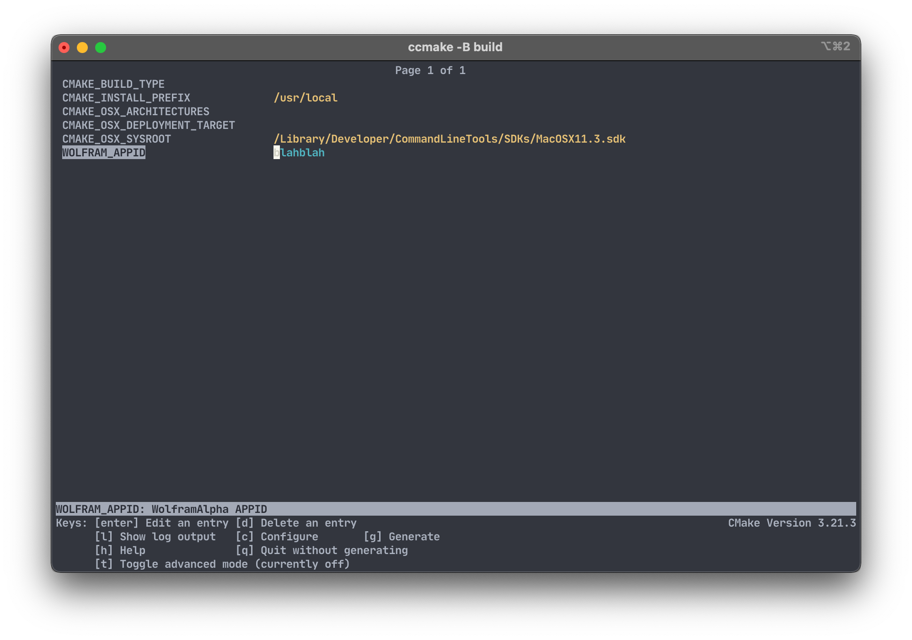

# Modern CMake By Example

## 知识点总结

### [`0_helloworld`](../../tree/0_helloworld)

`Makefile` 基本格式：

```makefile
name: dependencies
	commands
```

例如：

```makefile
hello: main.cpp
	$(CXX) -o hello main.cpp # CXX 是 Make 的内置变量
	echo "OK"
```

构建 & 运行命令：

```shell
$ make hello
$ ./hello
```

### [`1_helloworld`](../../tree/1_helloworld)

变量赋值：

```makefile
CC := clang
CXX := clang++ # 可通过 make CXX=g++ 形式覆盖

objects := main.o
```

使用变量：

```makefile
hello: $(objects)
	$(CXX) -o $@ $(objects) # $@ 是自动变量，表示 target 名

main.o: main.cpp
	$(CXX) -c main.cpp
```

### [`2_ask_for_answer`](../../tree/2_ask_for_answer)

Make 可以自动推断 `.o` 文件需要用什么命令从什么文件编译：

```makefile
objects := main.o answer.o

answer: $(objects)
	$(CXX) -o $@ $(objects)

main.o: answer.hpp
answer.o: answer.hpp
```

### [`4_switch_to_cmake`](../../tree/4_switch_to_cmake)

`CMakeLists.txt` 基本格式：

```cmake
cmake_minimum_required(VERSION 3.9)
project(answer)

add_executable(answer main.cpp answer.cpp)
```

生成 & 构建 & 运行命令：

```shell
cmake -B build      # 生成构建目录，-B 指定生成的构建系统代码放在 build 目录
cmake --build build # 执行构建
./build/answer      # 运行 answer 程序
```

### [`5_split_library`](../../tree/5_split_library)

项目中可以复用的部分可以拆成 library：

```cmake
add_library(libanswer STATIC answer.cpp)
```

`STATIC` 表示 `libanswer` 是个静态库。

使用（链接）library：

```cmake
add_executable(answer main.cpp)
target_link_libraries(answer libanswer)
```

### [`6_subdirectory`](../../tree/6_subdirectory)

功能独立的模块可以放到单独的子目录：

```
.
├── answer
│  ├── answer.cpp
│  ├── CMakeLists.txt
│  └── include
│     └── answer
│        └── answer.hpp
├── CMakeLists.txt
└── main.cpp
```

```cmake
# CMakeLists.txt
add_subdirectory(answer)

add_executable(answer_app main.cpp)
target_link_libraries(answer_app libanswer) # libanswer 在 answer 子目录中定义
```

```cmake
# answer/CMakeLists.txt
add_library(libanswer STATIC answer.cpp)
target_include_directories(libanswer PUBLIC ${CMAKE_CURRENT_SOURCE_DIR}/include)
```

`CMAKE_CURRENT_SOURCE_DIR` 是 CMake 内置变量，表示当前 `CMakeLists.txt` 文件所在目录，此处其实可以省略。

`target_include_directories` 的 `PUBLIC` 参数表示这个包含目录是 `libanswer` 的公开接口一部分，链接 `libanswer` 的 target 可以 `#include` 该目录中的文件。

### [`7_use_libcurl`](../../tree/7_use_libcurl)

系统中安装的第三方库可以通过 `find_package` 找到，像之前的 `libanswer` 一样链接：

```cmake
find_package(CURL REQUIRED)
target_link_libraries(libanswer PRIVATE CURL::libcurl)
```

`REQUIRED` 表示 `CURL` 是必须的依赖，如果没有找到，会报错。

`PRIVATE` 表示“链接 `CURL::libcurl`”是 `libanswer` 的私有内容，不应对使用 `libanswer` 的 target 产生影响，注意和 `PUBLIC` 的区别。

`CURL` 和 `CURL::libcurl` 是约定的名字，其它第三方库的包名和 library 名可在网上查。

### [`8_link_libs_in_same_root`](../../tree/8_link_libs_in_same_root)

可以链接同一项目中其它子目录中定义的 library：

```cmake
# CMakeLists.txt
add_subdirectory(answer)
add_subdirectory(curl_wrapper)
add_subdirectory(wolfram)
```

```cmake
# answer/CMakeLists.txt
add_library(libanswer STATIC answer.cpp)
target_include_directories(libanswer PUBLIC ${CMAKE_CURRENT_SOURCE_DIR}/include)
target_link_libraries(libanswer PRIVATE wolfram)
```

```cmake
# wolfram/CMakeLists.txt
add_library(wolfram STATIC alpha.cpp)
target_include_directories(wolfram PUBLIC ${CMAKE_CURRENT_SOURCE_DIR}/include)
target_link_libraries(wolfram PRIVATE curl_wrapper)
```

```cmake
# curl_wrapper/CMakeLists.txt
find_package(CURL REQUIRED)
add_library(curl_wrapper STATIC curl_wrapper.cpp)
target_include_directories(curl_wrapper
                           PUBLIC ${CMAKE_CURRENT_SOURCE_DIR}/include)
target_link_libraries(curl_wrapper PRIVATE CURL::libcurl)
```

搞清楚项目各模块间的依赖关系很重要：



### [`9_cache_string`](../../tree/9_cache_string)

#### Cache 变量

私密的 App ID、API Key 等不应该直接放在代码里，应该做成可配置的项，从外部传入。除此之外还可通过可配置的变量来控制程序的特性、行为等。在 CMake 中，通过 cache 变量实现：

```cmake
set(WOLFRAM_APPID "" CACHE STRING "WolframAlpha APPID")
```

`set` 第一个参数是变量名，第二个参数是默认值，第三个参数 `CACHE` 表示是 cache 变量，第四个参数是变量类型，第五个参数是变量描述。

`BOOL` 类型的 cache 变量还有另一种写法：

```cmake
set(ENABLE_CACHE OFF CACHE BOOL "Enable request cache")
option(ENABLE_CACHE "Enable request cache" OFF) # 和上面基本等价
```

Cache 变量的值可在命令行调用 `cmake` 时通过 `-D` 传入：

```shell
cmake -B build -DWOLFRAM_APPID=xxx
```

也可用 `ccmake` 在 TUI 中修改：



#### `target_compile_definitions`

要让 C++ 代码能够拿到 CMake 中的变量，可添加编译时宏定义：

```cmake
target_compile_definitions(libanswer PRIVATE WOLFRAM_APPID="${WOLFRAM_APPID}")
```

这会给 C++ 代码提供一个 `WOLFRAM_APPID` 宏。

### [`10_interface_library`](../../tree/10_interface_library)

Header-only 的库可以添加为 `INTERFACE` 类型的 library：

```cmake
add_library(libanswer INTERFACE)
target_include_directories(libanswer INTERFACE ${CMAKE_CURRENT_SOURCE_DIR}/include)
target_compile_definitions(libanswer INTERFACE WOLFRAM_APPID="${WOLFRAM_APPID}")
target_link_libraries(libanswer INTERFACE wolfram)
```

通过 `target_xxx` 给 `INTERFACE` library 添加属性都要用 `INTERFACE`。

### [`11_target_compile_features`](../../tree/11_target_compile_features)

可以针对 target 要求编译 feature（即指定要使用 C/C++ 的什么特性）：

```cmake
target_compile_features(libanswer INTERFACE cxx_std_20)
```

和直接设置 `CMAKE_CXX_STANDARD` 的区别：

1. `CMAKE_CXX_STANDARD` 会应用于所有能看到这个变量的 target，而 `target_compile_features` 只应用于单个 target
2. `target_compile_features` 可以指定更细粒度的 C++ 特性，例如 `cxx_auto_type`、`cxx_lambda` 等。

### [`12_testing`](../../tree/12_testing)

#### CTest

要使用 CTest 运行 CMake 项目的测试程序，需要在 `CMakeLists.txt` 添加一些内容：

```cmake
# CMakeLists.txt
cmake_minimum_required(VERSION 3.14) # 提高了 CMake 版本要求
project(answer)

if(CMAKE_PROJECT_NAME STREQUAL PROJECT_NAME)
    include(CTest)
endif()
```

```cmake
# answer/CMakeLists.txt
if(BUILD_TESTING)
    add_subdirectory(tests)
endif()
```

```cmake
# answer/tests/CMakeLists.txt
add_executable(test_some_func test_some_func.cpp)
add_test(NAME answer.test_some_func COMMAND test_some_func)
```

`BUILD_TESTING` 是 `include(CTest)` 之后添加的一个 cache 变量，默认 `ON`，可通过 `-D` 参数修改。

在命令行运行所有 `answer` 模块的测试程序：

```shell
$ ctest --test-dir build -R "^answer."
```

#### FetchContent

除了使用 `find_package` 找到系统中安装的第三方库，也可通过 CMake 3.11 新增的 FetchContent 功能下载使用第三方库：

```cmake
include(FetchContent)

FetchContent_Declare(
    catch2 # 建议使用全小写
    GIT_REPOSITORY https://github.com/catchorg/Catch2.git
    GIT_TAG v3.0.0-preview3)

FetchContent_MakeAvailable(catch2)

target_link_libraries(test_some_func} PRIVATE Catch2::Catch2WithMain)
```

`FetchContent_MakeAvailable` 要求 CMake 3.14，如果要支持更旧版本，或者需要更细粒度的控制，可以使用如下替代：

```cmake
FetchContent_GetProperties(catch2)
if(NOT catch2_POPULATED)
    FetchContent_Populate(catch2)
    add_subdirectory(${catch2_SOURCE_DIR} ${catch2_BINARY_DIR})
endif()
```

#### Macro & Function

当需要多次重复同一段 CMake 脚本时，可以定义宏或函数：

```cmake
macro(answer_add_test TEST_NAME)
    add_executable(${TEST_NAME} ${ARGN}) # ${ARGN} 类似于 C/C++ 中的 __VA_ARGS__
    add_test(NAME answer.${TEST_NAME} COMMAND ${TEST_NAME})
    target_link_libraries(${TEST_NAME} PRIVATE libanswer)
    target_link_libraries(${TEST_NAME} PRIVATE Catch2::Catch2WithMain)
endmacro()

answer_add_test(test_check_the_answer test_check_the_answer.cpp)
answer_add_test(test_another_function test_another_function.cpp)
```

宏和函数的区别与 C/C++ 中的宏和函数的区别相似。

### [`13_back_to_makefile`](../../tree/13_back_to_makefile)

调用 CMake 命令往往需要传很多参数，并且 CMake 生成、CMake 构建、CTest 的命令都不太相同，要获得比较统一的使用体验，可以在外面包一层 Make：

```makefile
WOLFRAM_APPID :=

.PHONY: build configure run test clean

build: configure
	cmake --build build

configure:
	cmake -B build -DWOLFRAM_APPID=${WOLFRAM_APPID}

run:
	./build/answer_app

test:
	ctest --test-dir build -R "^answer."

clean:
	rm -rf build
```

从而方便在命令行调用：

```shell
$ make build WOLFRAM_APPID=xxx
$ make test
$ make run
$ make clean
```

### 补充 1

CMake 是代码，应该格式化，格式化工具：<https://github.com/cheshirekow/cmake_format>。

### 补充 2

糜老师要求补充：Linux 内核是可以修改并替换的，只需要下载内核源码，然后：

```shell
$ make defconfig # 有各种 xxxconfig
$ make menuconfig # TUI 界面修改 config
$ make # 构建 Linux 内核
$ make modules_install # 安装内核模块
$ make install # 安装内核
```

## 直播时的 Q&A

由于直播时候录屏里没有录到腾讯会议的聊天记录窗口，导致看回放时看不到原问题，这里列出一下。

### CMake 是怎么找到 `.cpp` 文件依赖的头文件的？

它没有自己去找 `.cpp` 文件的依赖，而是在生成的 `Makefile` 里面，使用 GCC 等编译器的 `-M` 参数生成 `.d` 依赖文件，这个在其它使用 Make 管理构建的项目里应该也是常见用法。

### 模块依赖图是人工画的还是自动生成的？

是人工画的，用的是 VSCode 插件 [Draw.io Integration](https://marketplace.visualstudio.com/items?itemName=hediet.vscode-drawio)。

### 在 `CMakeLists.txt` 里定义变量并检查要求不为空，会导致 VSCode 乱报错吗？

VSCode 装了 [CMake Tools](https://marketplace.visualstudio.com/items?itemName=ms-vscode.cmake-tools) 插件的情况下，修改 `CMakeLists.txt` 后它会自动执行 CMake Configure，如果有要求非空的 cache 变量，它会报错，这时候直接去修改 `build/CMakeCache.txt`，给对应 cache 变量赋值即可。

也可以手动运行一次 `cmake` 命令，用 `-D` 参数传入变量，此后只要不删除 `build/CMakeCache.txt`，就不会再报错。

### FetchContent 每次编译都要重新编译一遍依赖库吗？

不会，`cmake --build build` 是会增量编译的。另外只要不删除 `build/_deps`，即使删了 `build/CMakeCache.txt`，之后重新 configure 也不会重新下载依赖。

### 能来个 VSCode 插件推荐列表吗？

我自己在用的：

<details>

<summary>点击展开</summary>

- Better C++ Syntax
- Bookmarks
- C/C++
- C/C++ GNU Global（适合阅读修改 Linux 内核用）
- CMake
- CMake Tools
- cmake-format
- Code Runner
- crates
- Diff
- Draw.io Integration
- Error Lens
- Even Better TOML
- GitHub Copilot
- GitLens
- Hex Editor
- hexdump for VSCode
- Include Autocomplete
- LaTeX Workshop
- Live Preview
- Markdown All in One
- Markdown Preview Enhanced
- Marp for VS Code
- Rainbow CSV
- Remote - SSH
- Run on Save
- rust-analyzer
- SVG Viewer
- Tabnine
- Task Explorer
- Todo Tree
- WakaTime

</details>

## 扩展阅读

### Makefile

- 跟我一起写 Makefile
    - https://seisman.github.io/how-to-write-makefile/introduction.html

### CMake

- Modern CMake
    - https://cliutils.gitlab.io/modern-cmake/
- More Modern CMake
    - https://hsf-training.github.io/hsf-training-cmake-webpage/
- C++Now 2017: Daniel Pfeifer "Effective CMake"
    - https://www.youtube.com/watch?v=bsXLMQ6WgIk
    - https://github.com/boostcon/cppnow_presentations_2017/blob/master/05-19-2017_friday/effective_cmake__daniel_pfeifer__cppnow_05-19-2017.pdf
- Effective Modern CMake
    - https://gist.github.com/mbinna/c61dbb39bca0e4fb7d1f73b0d66a4fd1
- CMake Documentation
    - https://cmake.org/cmake/help/latest/index.html
